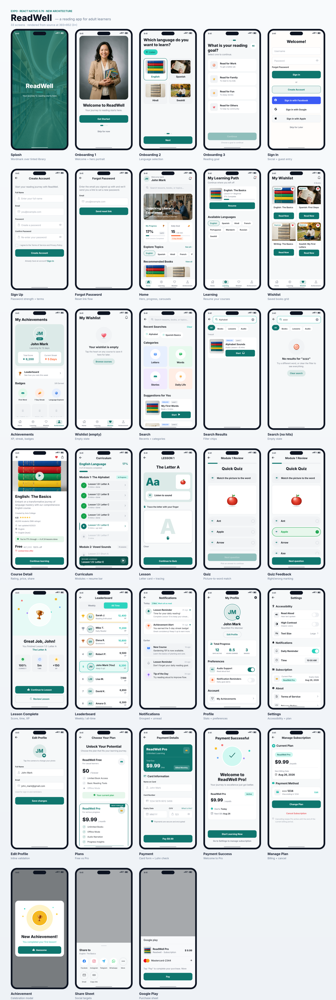

# ReadWell — Design Implementation Notes



The app was rebuilt to match the ReadWell Figma redesign. This document records
what was implemented, how the assets were produced, and which decisions were
judgement calls rather than direct reads from the source file.

## Provenance of the assets

The Figma file could not be reached from the build environment: `figma.com` and
`api.figma.com` are blocked at the network layer (TCP connects, TLS resets), no
Figma MCP server was available, and the page fetch returned only Figma's WebGL
error shell. The implementation was therefore built from **31 exported PNG
frames** supplied directly.

Because the original vector assets weren't available, imagery was regenerated:

| Asset | Source | Notes |
|---|---|---|
| `assets/images/*.jpg` | AI image generation | Hero, onboarding portrait, splash library, 4 course thumbnails |
| `assets/icons3d/trophy.png`, `flame.png` | AI image generation | Background matted out with a chroma-keyed flood fill |
| `assets/icons3d/*` (18 others) | Procedural render | `scripts/` style canvas renderer — layered gradients, rim light, specular |

All 3D icons carry a **real alpha channel**. The generator returns a *painted*
checkerboard rather than transparency, so a connected-component keyer
(saturation-based, border-seeded, with interior hole filling) was used to cut
them out and de-fringe the edges.

If you can share the original Figma exports for icons and photography, swapping
them in is a drop-in replacement — the filenames and sizes are already wired up.

## Design tokens

Extracted from the frames into `src/theme/index.js`:

```
primary        #0F766E   deep teal   — CTAs, headings, active tab
primaryDark    #0B5C55               — pressed state
primarySurface #DCEAE8               — tonal fills, icon wells
accent         #2DD4BF   turquoise   — XP, selected pills, "All Time" tab
gold           #F5B921               — trophies, ratings, streak
background     #F6F8F9               — app canvas
surface        #FFFFFF               — cards
textPrimary    #14181F
textSecondary  #6B7280
```

Radius runs `6 / 10 / 14 / 18 / 24 / 32 / pill`; spacing is a 4-point scale.
Shadows are deliberately soft (`0 2 6 / 6%` at rest) to match the flat, airy
feel of the frames.

## Screens added beyond the original app

The pre-redesign app had 10 screens. The redesign flow required 26:

**New:** Onboarding language + goal steps, ForgotPassword, Learning, Wishlist,
Achievements, Search (browse/results/empty), CourseDetail, Curriculum, Lesson
with finger tracing, LessonComplete, Leaderboard, Notifications, EditProfile,
Settings, Plans, PaymentDetails, PaymentSuccess, ManageSubscription, plus three
overlays (achievement, share, Google Play).

**Removed:** `LessonsScreen`, `LessonDetailScreen`, `ProgressScreen`,
`LoginScreen`, `SignupScreen` — superseded by the new curriculum and
achievement flows.

## Edge cases

Design files show the happy path; these were added to make the flow shippable.

- **Empty states** — wishlist, search results, curriculum not yet written,
  notifications, free-plan subscription management
- **Locked content** — non-free courses show a Pro lock and route to Plans;
  lessons unlock sequentially via `isLessonUnlocked`
- **Guest mode** — "Skip for Later" enters the app with a persistent prompt to
  create an account and save progress
- **Form validation** — email format, password strength meter, confirm-match,
  terms gate, Luhn card check, expiry-in-past, CVV length
- **Payment failure** — a card ending `0000` simulates a decline and surfaces an
  inline error banner rather than failing silently
- **Loading** — skeleton rows during search; button spinners on submit
- **Accessibility** — every control has a role and label; toggles expose state;
  progress bars report `min/max/now`; tap targets are ≥48dp

## Known deviations

1. **Photography differs** from the Figma exports — regenerated, not the
   original stock. Composition and crop were matched as closely as possible.
2. **Avatars** render as initials rather than the photographs in the leaderboard
   and profile frames; no avatar assets were available.
3. **Letter tracing** captures strokes with `PanResponder` and confirms input,
   but does not yet score stroke accuracy against the glyph path.
4. **Audio** ("Listen to sound", read-aloud) is wired through the UI with
   playing states but has no TTS engine attached.
5. The Google Play sheet is a **faithful visual mock**, not a real billing
   integration. Wire it to `expo-in-app-purchases` before shipping.

## Regenerating the screenshots

Screens in `docs/screenshots/` are rendered from the real components — mounted
with `react-test-renderer`, laid out with Yoga (the same engine React Native
uses), and painted to canvas with the app's own fonts and Ionicons. They are
build artefacts, not hand-made mockups, so they stay honest as the code changes.
